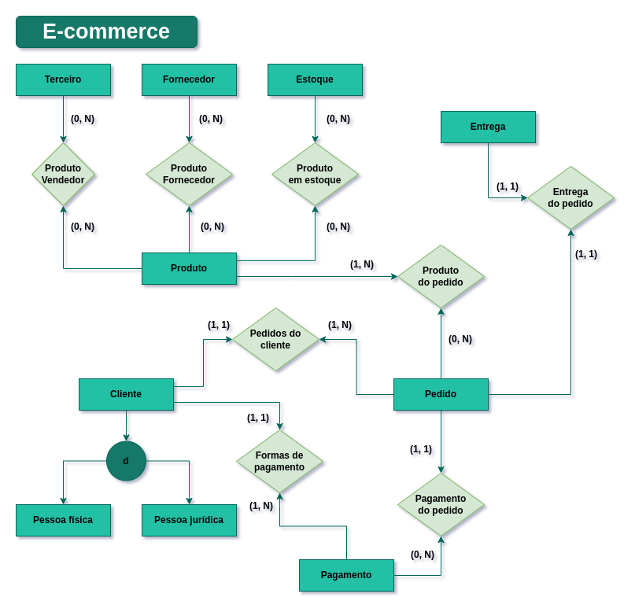
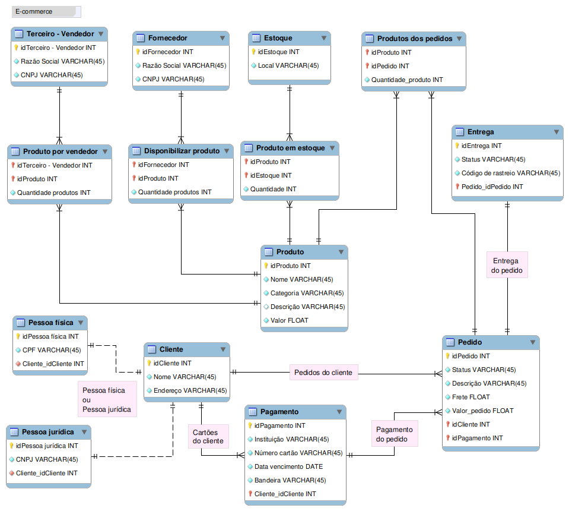

# 🛒 Modelagem de Banco de Dados: E-commerce (Marketplace)

  
  
  

 

> **Objetivo:** Projetar a arquitetura de dados para uma plataforma de E-commerce complexa, contemplando o fluxo desde o cadastro de produtos por terceiros (Marketplace) até a logística de entrega e processamento de pagamentos múltiplos.

---

## 🎯 Visão Geral do Projeto

Diferente de um e-commerce simples, este modelo foi desenhado para suportar um cenário de **Marketplace**, onde os produtos podem vir tanto de fornecedores diretos quanto de vendedores terceiros. O projeto foca na normalização de dados e na integridade referencial para garantir que pedidos, estoques e entregas estejam perfeitamente sincronizados.

Utilizei o **MySQL Workbench** (`.mwb`) para criar a modelagem física e lógica.

👉 **[Fazer o download do Arquivo do Modelo (.mwb)](e-commerce.mwb)**

---

## 📖 Regras de Negócio e Narrativa

A arquitetura foi construída sobre os seguintes pilares de negócio:

### 📦 Gestão de Produtos e Vendedores
- **Hibridismo:** Suporte para produtos vendidos pela plataforma e por vendedores terceiros.
- **Fornecedores:** Todo produto possui um fornecedor de origem vinculado.
- **Estoque:** Controle de localização física dos produtos.

### 👤 Gestão de Clientes e Pagamentos
- **Identificação Flexível:** Cadastro suporta tanto Pessoa Física (CPF) quanto Pessoa Jurídica (CNPJ).
- **Logística:** O endereço do cliente é o trigger para o cálculo automático de frete.
- **Carteira:** Um cliente pode gerenciar múltiplas formas de pagamento.

### 🧾 Ciclo do Pedido
- **Composição:** Pedidos podem conter múltiplos itens de diferentes vendedores.
- **Status:** Acompanhamento em tempo real desde a criação, cancelamento até a entrega final.
- **Rastreio:** Integração de código de rastreamento para controle logístico.

---

## 🏗️ Estrutura do Banco de Dados

### 🧩 Entidades Mapeadas

| Entidade | Atributos Chave |
| :--- | :--- |
| **Produto** | Nome, Descrição, Valor, Categoria |
| **Cliente** | Nome, Endereço, CPF/CNPJ (Especialização) |
| **Pedido** | ID, Status, Valor do Frete, Valor Total, Descrição |
| **Pagamento** | Instituição, Dados do Cartão, Vencimento |
| **Entrega** | Código de Rastreio, Status da Logística |
| **Fornecedor/Terceiros** | Razão Social, CNPJ |

### 🔗 Relacionamentos Complexos
- `[Pedido] N:M [Produto]`: Tabela intermediária para itens do pedido.
- `[Produto] N:M [Estoque]`: Controle de disponibilidade por localidade.
- `[Vendedores] N:M [Produto]`: Permite o modelo de marketplace.

---

## 🗺️ Documentação Visual

### 📐 Schema Lógico (EER)
Detalhamento técnico das tabelas e chaves estrangeiras:

### 📊 Schema Conceitual (UML)
Abstração das entidades e fluxos de informação:

---
*Este repositório demonstra proficiência em **Engenharia de Requisitos** e **Modelagem de Dados** aplicada a ecossistemas de vendas digitais.*
